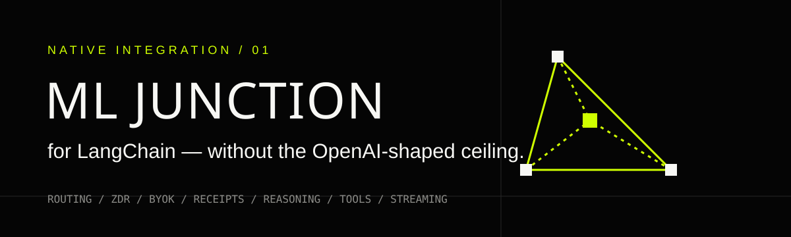

<p align="center"></p>

# langchain-mljunction

The native LangChain integration for ML Junction. It calls `/v1/responses` and `/v1/embeddings`
directly—there is no `ChatOpenAI` wrapper and no vendor-shaped ceiling between your chain and ML
Junction's routing, governance, privacy, billing, and observability features.

## Install

```bash
pip install langchain-mljunction
```

Set `MLJUNCTION_API_KEY` and optionally `MLJUNCTION_BASE_URL`, or pass both to the constructor.

## Start in 30 seconds

```python
from langchain_mljunction import ChatMLJunction

llm = ChatMLJunction(
    model="gpt-4o-mini",
    routing={
        "strategy": "balanced",
        "service_tier": "auto",
        "require_zdr": True,
        "max_platform_charge_usd": 0.05,
    },
    app_name="support-agent",
    session_name="customer-42",
    task_name="triage-ticket",
)

answer = llm.invoke("Explain the incident in three bullets")
print(answer.content)
print(answer.response_metadata["routing"])
print(answer.response_metadata["receipt"])
```

## Native controls, first class

`ChatMLJunction` exposes the native request surface: sampling controls, `reasoning`, `output`,
`requirements`, `routing`, `context`, `metadata`, `idempotency_key`, session/task identity, and
`compatibility`. Per-call overrides work with `invoke`, `stream`, `batch`, and async equivalents.

```python
llm = ChatMLJunction(
    model="claude-opus-4-6",
    reasoning={"enabled": True, "effort": "high"},
    requirements={"reasoning": "required", "tools": "preferred"},
    routing={
        "strategy": "quality",
        "mode": "byok_strict",
        "provider": "anthropic",
        "fallbacks": {"provider": False, "model": False},
    },
    context={"mode": "strict", "preserve_tool_chains": True},
)
```

Signed Anthropic thinking blocks are retained in `AIMessage.additional_kwargs` and replayed as
opaque blocks on the next turn. The gateway independently prevents those blocks from crossing to
a non-Anthropic or non-continuity-capable route.

## Tools, structured output, and streaming

```python
from pydantic import BaseModel

class Decision(BaseModel):
    action: str
    confidence: float

decision = llm.with_structured_output(Decision).invoke("Choose: retry or escalate")
tool_llm = llm.bind_tools([lookup_customer], tool_choice="auto", strict=True)
for chunk in tool_llm.stream("Check account 42"):
    print(chunk.content, end="")
```

Sync/async invocation, text streaming, streamed tool arguments, tool binding, strict JSON Schema,
multimodal content, and LangSmith metadata are supported.

## Embeddings

```python
from langchain_mljunction import MLJunctionEmbeddings

embeddings = MLJunctionEmbeddings(
    model="text-embedding-3-small",
    dimensions=1024,
    routing={"strategy": "latency", "max_platform_charge_usd": 0.01},
)
vectors = embeddings.embed_documents(["route", "receipt", "reasoning"])
```

Every `AIMessage` carries standard `usage_metadata`. `response_metadata` retains request ID,
model, routing, receipt, warnings, session/task/app identity, and reasoning state—nothing important
is discarded to imitate another provider.

## Development

```bash
pip install -e ".[test]"
pytest
ruff check src tests
```

Live tests are opt-in with `RUN_LIVE_PROVIDER_TESTS=1`, `LIVE_API_KEY`, and `LIVE_API_BASE`.
