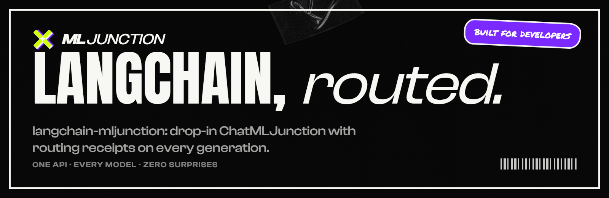

<p align="center"></p>

# langchain-mljunction

The native LangChain integration for ML Junction. It calls `/v1/responses` and `/v1/embeddings`
directly—there is no `ChatOpenAI` wrapper and no vendor-shaped ceiling between your chain and ML
Junction's routing, governance, privacy, billing, and observability features.

## Install

Until the package is published, install it from a checkout:

```bash
git clone https://github.com/mljunction/langchain-mljunction.git
cd langchain-mljunction
pip install .
```

For local SDK development:

```bash
pip install -e ".[test]"
```

Set `MLJUNCTION_API_KEY` and optionally `MLJUNCTION_BASE_URL`, or pass both to the constructor.
The default base URL is `http://localhost:8001`, so the SDK works directly with a local ML Junction
server.

## Start in 30 seconds

```python
from langchain_mljunction import ChatMLJunction

llm = ChatMLJunction(
    model="gpt-5-mini",
    base_url="http://localhost:8001",
    routing={
        "strategy": "balanced",
        "service_tier": "auto",
        "require_zdr": True,
        "max_platform_charge_usd": 0.05,
    },
    app_name="support-agent",
    session_name="customer-42",
    task_name="triage-ticket",
)

answer = llm.invoke("Explain the incident in three bullets")
print(answer.content)
print(answer.response_metadata["routing"])
print(answer.response_metadata["receipt"])
```

## Native controls, first class

`ChatMLJunction` exposes the native request surface: sampling controls, `reasoning`, `output`,
`requirements`, `routing`, `context`, `metadata`, `idempotency_key`, session/task identity, and
`compatibility`. Per-call overrides work with `invoke`, `stream`, `batch`, and async equivalents.

```python
llm = ChatMLJunction(
    model="gpt-5-mini",
    reasoning={"enabled": True, "effort": "high"},
    requirements={"reasoning": "required", "tools": "preferred"},
    routing={
        "strategy": "quality",
        "mode": "platform_only",
        "fallbacks": {"provider": True, "model": True},
    },
    context={"mode": "strict", "preserve_tool_chains": True},
)
```

Provider-native reasoning details are retained in
`AIMessage.additional_kwargs["reasoning_details"]` and replayed on that exact assistant message.
The encrypted `gwrt_v3` routing token is retained in `response_metadata["reasoning"]` and is
automatically supplied with the next full message history. Pass
`reasoning={"continuation_token": None}` to intentionally abandon replay for a fork. The token
contains routing affinity only; it does not contain conversation history, reasoning, or credentials.

## Tools, structured output, and streaming

```python
from langchain_core.messages import HumanMessage, ToolMessage
from langchain_core.tools import tool
from pydantic import BaseModel


class Decision(BaseModel):
    action: str
    confidence: float


decision = llm.with_structured_output(Decision).invoke("Choose: retry or escalate")
print(decision)

# LangChain's standard method selector is supported.
decision = llm.with_structured_output(
    Decision,
    method="json_schema",  # also "function_calling" or "json_mode"
).invoke("Choose: retry or escalate")


@tool
def lookup_customer(customer_id: str) -> str:
    """Look up a customer account."""
    return f"Customer {customer_id} is active"


tool_llm = llm.bind_tools(
    [lookup_customer],
    tool_choice="auto",
    strict=True,
    parallel_tool_calls=True,
)

messages = [HumanMessage("Check account 42")]
assistant = tool_llm.invoke(messages)
messages.append(assistant)

for call in assistant.tool_calls:
    result = lookup_customer.invoke(call["args"])
    messages.append(ToolMessage(result, tool_call_id=call["id"]))

final = tool_llm.invoke(messages)
print(final.content)
```

Text and ordinary bound tool-call arguments can also be consumed incrementally:

```python
for chunk in tool_llm.stream("Check accounts 42 and 84"):
    if chunk.content:
        print(chunk.content, end="", flush=True)
    for call in chunk.tool_call_chunks:
        print("tool delta:", call)
```

Sync/async invocation, text streaming, streamed tool arguments, tool binding, strict JSON Schema,
parallel tool calls, multimodal content, and LangSmith metadata are supported. Tool execution remains
the application's responsibility: append each `ToolMessage` and invoke the model again. ML Junction
reasoning continuation automatically marks that follow-up as tool results, even when workflow
messages appear after the tool result.

Multimodal input accepts LangChain standard blocks and the common OpenAI/Anthropic-compatible forms
for image URLs/base64 images, base64 audio, PDFs/files, multimodal tool results, cache-control text,
and thinking blocks. The adapter normalizes them to ML Junction's provider-neutral message contract.

Structured-output runnables deliberately coerce `stream()` and `astream()` to one complete
`AIMessageChunk`. This applies to native JSON Schema/JSON mode and to function-calling used as a
structured-output method, so a LangChain parser never sees partial JSON. Ordinary
`bind_tools().stream()` calls remain incremental and LangChain reassembles their argument deltas.

`include_raw=True` follows LangChain's standard result contract and returns a dictionary containing
`raw`, `parsed`, and `parsing_error`. The complete unparsed `AIMessage` is available under `raw`;
read its `content` for native JSON Schema/JSON mode or `tool_calls` for function-calling.

## Sync, async, batch, and per-call overrides

```python
answer = llm.invoke("Hello")
answer = await llm.ainvoke("Hello")

answers = llm.batch(["One", "Two"])
answers = await llm.abatch(["One", "Two"])

high_effort = llm.invoke(
    "Analyze this carefully",
    reasoning={"enabled": True, "effort": "high"},
    session_id="analysis-session-1",
)
```

Use a stable `session_id` for related requests when you want sticky routing and coherent request
grouping in ML Junction's activity logs.

## Embeddings

```python
from langchain_mljunction import MLJunctionEmbeddings

embeddings = MLJunctionEmbeddings(
    model="text-embedding-3-small",
    dimensions=1024,
    routing={"strategy": "latency", "max_platform_charge_usd": 0.01},
)
vectors = embeddings.embed_documents(["route", "receipt", "reasoning"])
```

Every `AIMessage` carries standard `usage_metadata`. `response_metadata` retains request ID,
model, routing, receipt, warnings, session/task/app identity, and reasoning state—nothing important
is discarded to imitate another provider.

## Errors and transport lifecycle

API failures raise `MLJunctionAPIError` with the HTTP status and ML Junction error payload. Streaming
errors are read and decoded before the exception is raised, for both sync and async clients.

Long-lived applications should close the owned HTTP transports:

```python
llm.close()

# Async applications:
await llm.aclose()
```

## Development

```bash
pip install -e ".[test]"
pytest
ruff check src tests
```

Live tests are opt-in with `RUN_LIVE_PROVIDER_TESTS=1`, `LIVE_API_KEY`, and `LIVE_API_BASE`.
The `tests/standard_tests` directory subclasses LangChain's `ChatModelUnitTests` and
`ChatModelIntegrationTests`; run it whenever the supported LangChain contract changes.
The stream timing test uses a sanitized cassette in `tests/cassettes` and can be verified with
`--record-mode=none`. Its replay has also been validated with the gateway stopped and pytest sockets
disabled, ensuring routine benchmark runs cannot make an accidental provider request.
